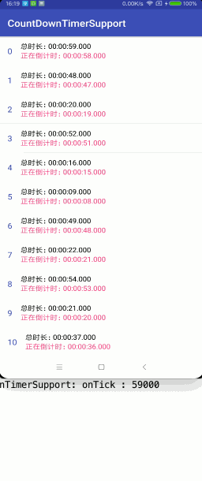

# CountDownTimerSupport
Android倒计时器，支持开始倒计时、暂停倒计时、继续倒计时、停止倒计时、重新倒计时

## 效果演示



## 快速开始
### Android Studio - 在build.gradle中引入
```java
compile 'in.xiandan:count-down-timer:1.0.3'
```
#### 初始化
```
//总时长 间隔时间
CountDownTimerSupport mTimer = new CountDownTimerSupport(millisInFuture, countDownInterval);
// SimpleOnCountDownTimerListener
mTimer.setOnCountDownTimerListener(new OnCountDownTimerListener() {
    @Override
    public void onTick(long millisUntilFinished) {
        // 倒计时间隔
    }

    @Override
    public void onFinish() {
        // 倒计时结束
    }

    @Override
    public void onCancel() {
        // 倒计时手动停止
    }
});
```

#### 启动倒计时
```
mTimer.start();
```

#### 暂停倒计时
```
mTimer.pause();
```

#### 恢复倒计时
```
mTimer.resume();
```

#### 停止倒计时
```
mTimer.stop();
```

#### 重置并启动倒计时
```
mTimer.reset();
mTimer.start();
```
