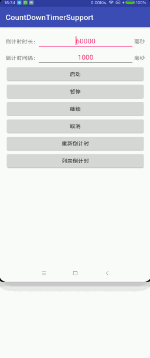

# CountDownTimerSupport
Android倒计时器，支持开始倒计时、暂停倒计时、继续倒计时、停止倒计时、重新倒计时

## 示例apk


## 效果演示


## 快速开始
### Android Studio - 在build.gradle中引入
```java
compile 'com.dyhdyh.support:count-down-timer:1.0.0'
```
#### 初始化
```
//总时长 间隔时间
CountDownTimerSupport mTimer = new CountDownTimerSupport(millisInFuture, countDownInterval);
mTimer.setOnCountDownTimerListener(new OnCountDownTimerListener() {
            @Override
            public void onTick(long millisUntilFinished) {
                //间隔回调
            }

            @Override
            public void onFinish() {
                //计时器停止
            }
        });
```

#### 启动倒计时
```
mTimer.start();
```

#### 暂停倒计时
```
mTimer.pause();
```

#### 恢复倒计时
```
mTimer.resume();
```

#### 停止倒计时
```
mTimer.stop();
```

#### 重置并启动倒计时
```
mTimer.reset();
mTimer.start();
```

#### 重新设置时长与间隔时间
```
mTimer.setMillisInFuture(millisInFuture);
mTimer.setCountDownInterval(countDownInterval);
```
###### Android交流群：[146262062](https://jq.qq.com/?_wv=1027&k=47XqOHO)